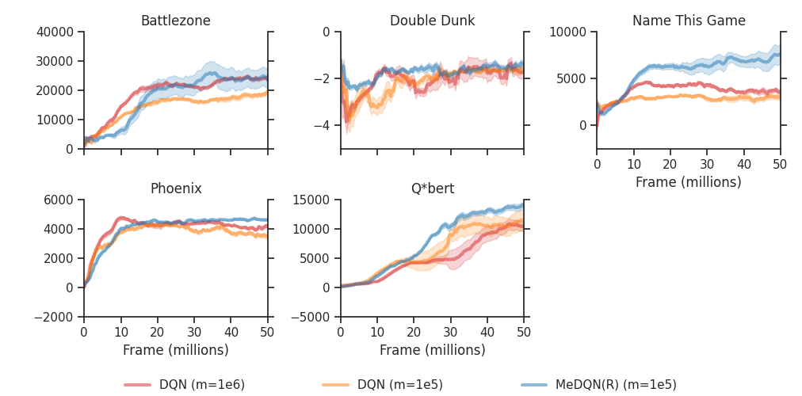

# MeDQN

This is the official implementation of *MeDQN* algorithm, introduced in our paper [Memory-efficient Reinforcement Learning with Value-based Knowledge Consolidation](https://arxiv.org/abs/2205.10868).  
Note that this codebase is for Atari experiments only. Please check the implementation of MeDQN in [Explorer](https://github.com/qlan3/Explorer) for other games.

Catastrophic forgetting prevents an agent from continual learning. In deep RL, this problem is largely masked by using a large replay buffer.
In this work, we show that by reducing forgetting with value-based lnowledge consolidation, we can improve memory efficiency, sample efficiency, and computational efficiency all together.
Specifically, in Atari games, our method (MeDQN) can reduce the memory size of the replay buffer in DQN from 7GB to 0.7GB, while achieving comparable or better performance, higher sample efficiency, and faster training speed.

Please share it with anyone who might be interested. Email me or submit an issue if you have any questions!

Plot of median score on each individual Atari game for each agent (`m` is the size of the replay buffer):




## Installation

- Python (>=3.8.10)
- [PyTorch](https://pytorch.org/): GPU version
- Others: see `requirements.txt`.

   ```bash
   pip install -r requirements.txt
   ```

## Usage

### Hyperparameter and Experiments

All hyperparameters, including parameters for grid search, are stored in a configuration file in the directory `configs`. To run an experiment, a configuration index is first used to generate a configuration dict corresponding to this specific configuration index. Then we run an experiment defined by this configuration dict. All results, including log files, are saved in the directory `logs`. Please refer to the codebase for details.

For example, run an experiment with configuration file `medqn.json` and configuration index `1`:

```bash
python main.py --config_file ./configs/medqn.json --config_idx 1
```

To do a grid search, we first compute the number of total combinations in a configuration file (e.g. `medqn.json`):

```bash
python utils/sweeper.py
```

The output will be:

`The number of total combinations in medqn.json: 60`

Then we run through all configuration indexes from `1` to `60`. The simplest way is using a bash script:

```bash
for index in {1..60}
do
  python main.py --config_file ./configs/medqn.json --config_idx $index
done
```

[Parallel](https://www.gnu.org/software/parallel/) is usually a better choice to schedule a large number of jobs:

```bash
parallel --ungroup --jobs procfile python main.py --config_file ./configs/medqn.json --config_idx {1} ::: $(seq 1 60)
```

Any configuration index with the same remainder (divided by the number of total combinations) should have the same configuration dict (except the random seed if `generate_random_seed = True`). So for multiple runs, we just need to add the number of total combinations to the configuration index. For example, 5 runs for configuration index `1`:

```bash
for index in 1 61 121 181 241
do
  python main.py --config_file ./configs/medqn.json --config_idx $index
done
```

Or a simpler way:

```bash
parallel --ungroup --jobs procfile python main.py --config_file ./configs/medqn.json --config_idx {1} ::: $(seq 1 60 300)
```


### Analysis

To analyze the experimental results, just run:

```bash
python analysis.py
```

Inside `analysis.py`, `unfinished_index` will print out the configuration indexes of unfinished jobs based on the existence of the result file. `memory_info` will print out the memory usage information and generate a histogram to show the distribution of memory usages in the directory `logs/medqn/0`. Similarly, `time_info` will print out the time information and generate a histogram to show the time distribution in the directory `logs/medqn/0`. Finally, `analyze` will generate `csv` files that store training and test results. Please check `analysis.py` for more details. More functions are available in `utils/plotter.py`.

Run `gather_results.py` to gather all Atari results into `csv` files in the directory `results`.

Finally, run `plot.py` to plot the learning curves of all Atari results in the directory `results`.


## Citation

If you find this work useful to your research, please cite our paper.

```bibtex
@article{lan2023memoryefficient,
  title={Memory-efficient Reinforcement Learning with Value-based Knowledge Consolidation},
  author={Lan, Qingfeng and Pan, Yangchen and Luo, Jun and Mahmood, A. Rupam},
  journal={Transactions on Machine Learning Research},
  year={2023}
}
```

## Acknowledgement

We thank the following projects which provide great references:

- [Tianshou](https://github.com/thu-ml/tianshou)
- [Explorer](https://github.com/qlan3/Explorer)
